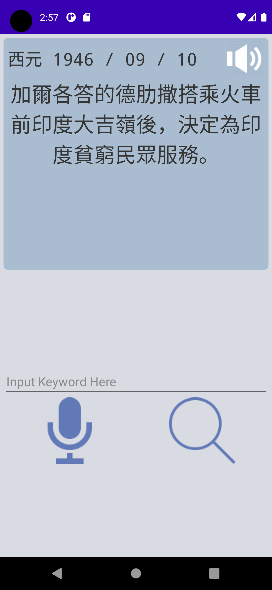
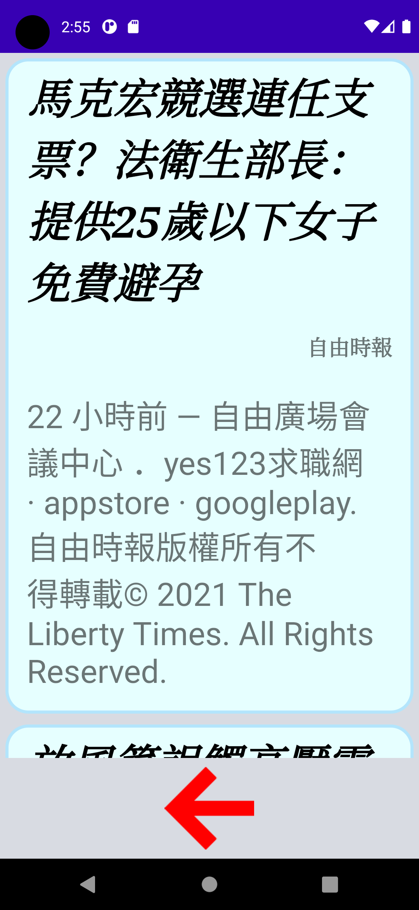
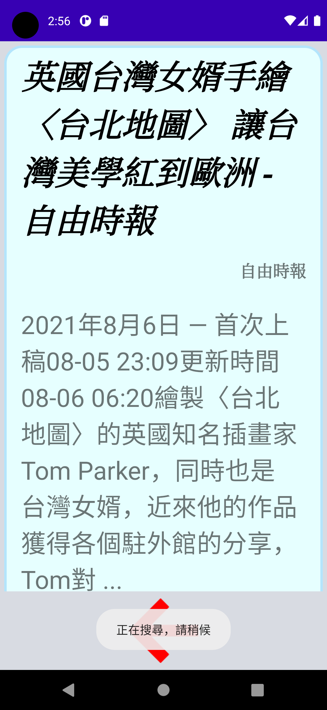
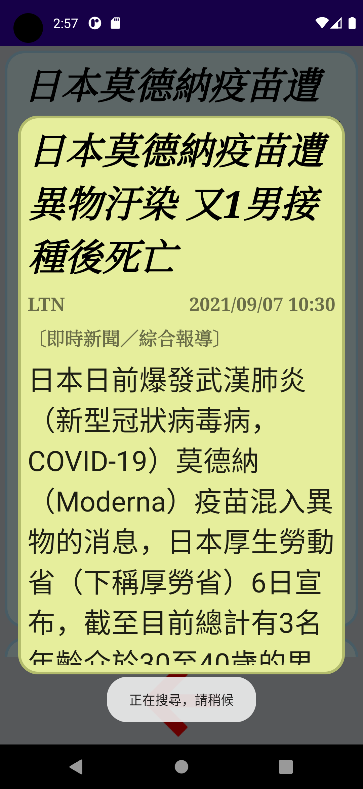

# DoIMIS_FinalProject

## Screenshots

### 首頁

首頁主要包含兩個部份：

1. 歷史上的今天

    可以點擊右上角圖示以播放台語介紹

2. 語音辨識 / 文字輸入 新聞關鍵詞

    輸入完關鍵詞後可以點擊放大鏡進入到媒體、類別選擇畫面

### 選擇媒體以及類別

點擊媒體、分類可以進行新聞來源、類別篩選

選擇完篩選條件後再點擊「右箭頭」即可進行搜尋

### 搜尋結果

根據關鍵字、篩選條件搜尋到的新聞、簡介

點擊後可以查看內文

### 查看新聞

新聞內文以及記者、時間等資訊

可以點擊任一段落來收聽該段落的台語報導

